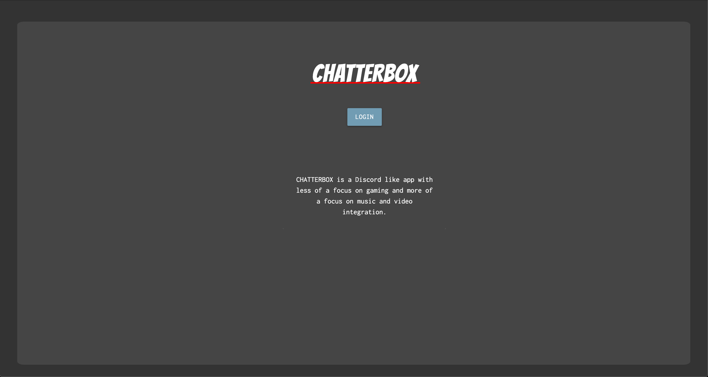
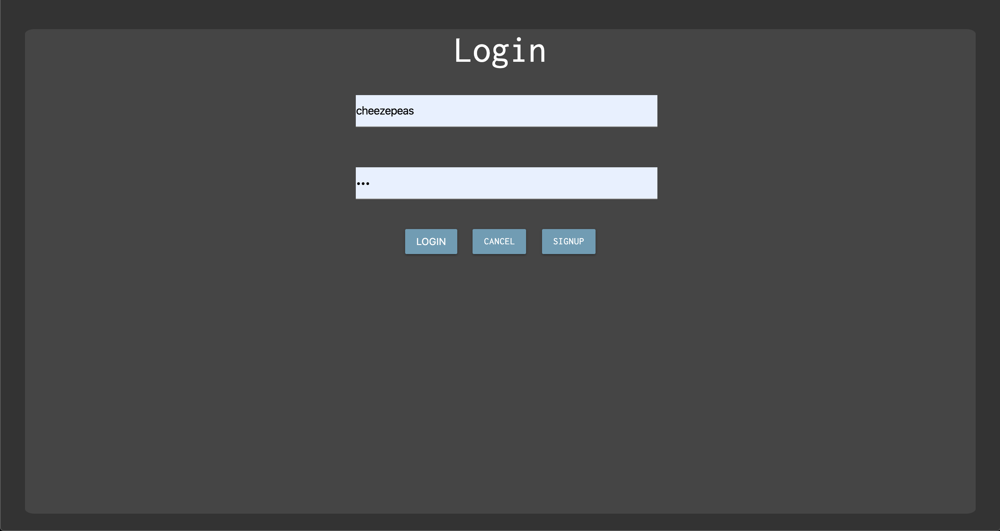
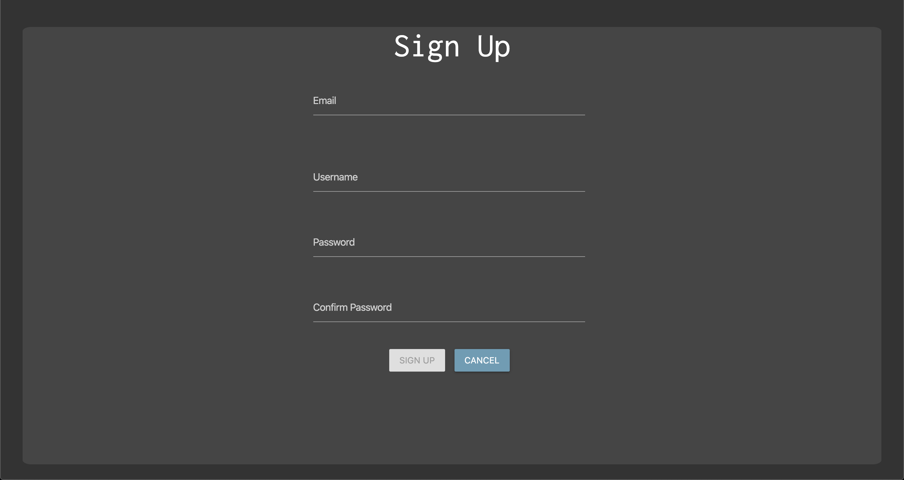
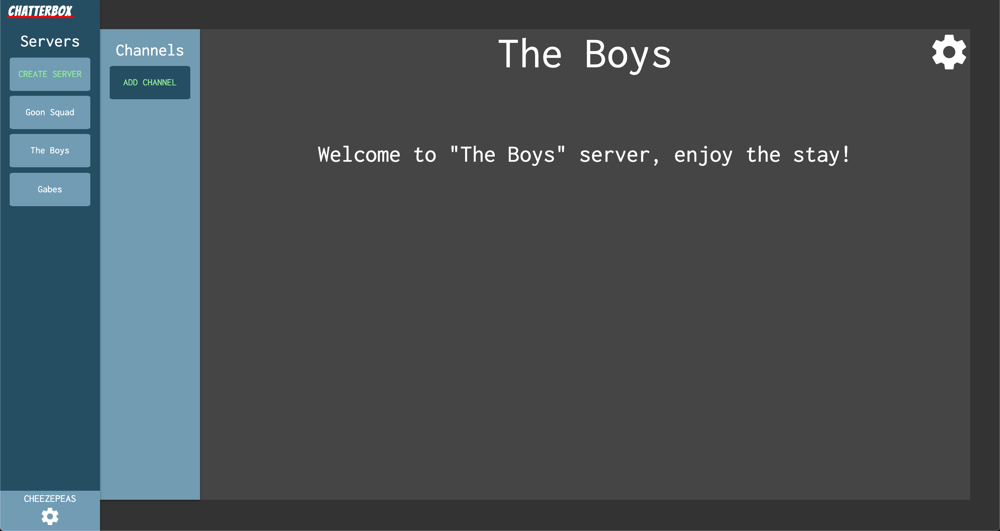

# Chatterbox

## Description

CHATTERBOX is a Discord like app with less of a focus on gaming and more of a focus on music and video integration.

## Screenshots

### Landing Page

### Login Page

### Signup Page

### Channel Page

## Technologies Used

- JavaScript
- HMTL
- Node
- Express
- MongoDB
- Mongoose
- React
- CSS/Materialize

## Getting Started

- [Chatterbox](https://chatterbox-v1.netlify.app/)
- [Trello Board](https://trello.com/b/44Ms1y0r/project-4-chatterbox)

## Next Steps

- Realtime voice communication
- Realtime messaging
- Custom music player
- Link various 3rd party music accounts and playlists
- watch videos with other users
- Allow users to have friends and blocked users
- Allow users to invite other users to certain servers

Check the Trello Board for more on the future of Chatterbox